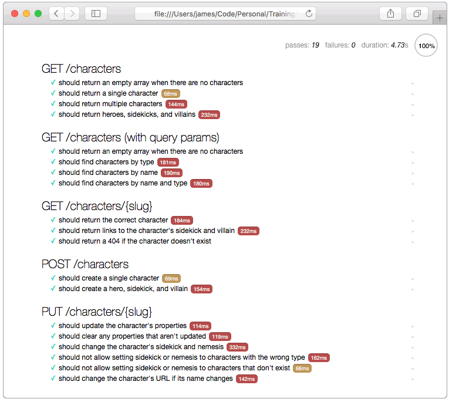

[](http://apitesting.bigstickcarpet.com)

[](http://mochajs.org)


Chai HTTP is an assertion library that uses [SuperAgent](https://visionmedia.github.io/superagent/) under the hood to do HTTP requests, and then lets you do assertions on the [HTTP response](https://visionmedia.github.io/superagent/#response-properties) using a really nice fluent syntax.

Here's an example:

```javascript
var response;

describe('add a trend', function() {
  before('add "Fixed-gear Bicycles"', function() {
    return http
      .post('/trends')
      .send({"name": "Fixed-gear Bicycles", "from": 1950, "to": 1959})
      .then(function(res) { response = res; });
  });

  it('should return an HTTP 201', function() {
    response.should.have.status(201);
  });

  it('should return only the new trend', function() {
    response.body.should.be.an('array').with.lengthOf(1);
    response.body.should.have.deep.members([
      {"name": "Fixed-gear Bicycles", "from": 1950, "to": 1959}
    ]);
  });
});
```


Killer Feature: Browser testing
--------------------------
Chai-HTTP is the only framework that lets you run your tests in web browsers in addition to the CLI.  This is a **huge feature**, since there's a really good chance that the apps that consume your REST API will be web-based, so Chai-HTTP allows you to run your tests in _real-world_ scenarios.

Any web-based application (including [hybrid mobile apps](http://developer.telerik.com/featured/what-is-a-hybrid-mobile-app/)) is subject to the [Same-Origin Policy](https://en.wikipedia.org/wiki/Same-origin_policy) and [Content Security Policy](https://en.wikipedia.org/wiki/Content_Security_Policy), which limits _many_ of the HTTP features that are accessible to the app. The app may not be able to read or write certain HTTP headers (including cookies), it may not be allowed to use certain HTTP methods (post, delete, etc.), and it might not be allowed to access certain resources or domains.

With Chai-HTTP, you can run your entire test suite in _any_ web browser and on _any_ mobile device.  So not only can you be assured that your API works in those environments, but you can also write tests **for your customers** to run from their app/domain/sandbox.


Installation
--------------------------

1. __Install Node.js__<br>
To run the demo, you'll need to have [Node.js 4.0 or greater](https://nodejs.org/en/) installed on your system.

2. __Clone this repo__<br>
`git clone https://github.com/bigstickcarpet/super-powered-api-testing.git`

3. __Install dependencies__<br>
`npm install` (this may take a while)


Running the tests in a CLI
--------------------------
The [`package.json`](package.json) file includes several scripts to make it easy for you to run the tests from a command-line.  Just `cd` to the root directory of the project, and then run the following command:

```bash
npm test
```

Runs mocha.  Uses https://api.heroes.bigstickcarpet.com by default.  Can set `API_ROOT` environment variable to override host

### `npm start`
St
| command                | description
|------------------------|------------------------------------
| `npm test`             | Runs the tests
| `start`            | Start a local web server running the sample REST API


Running the tests in an IDE
--------------------------
Many popular IDEs and text editors have built-in support for [Mocha](https://mochajs.org/), so you can easily run your tests with the press of a button and see the results right in your IDE.

  - [How to use Mocha in IntelliJ or WebStorm](https://www.youtube.com/watch?v=4mKiGkokyx8))
  - [How to use Mocha in Visual Studio](https://github.com/Microsoft/nodejstools/wiki/Test-Explorer)
  - [Mocha plug-ins for Atom](https://atom.io/packages/search?q=mocha)
  - [Mocha package for Emacs](https://github.com/scottaj/mocha.el)


Running the tests in a web browser
--------------------------
Mocha and Chai allow you to run your tests in a web browser. This is a _fantastic_ feature, so definitely try it out.  You can even run your tests in mobile browsers, such as iOS, Android, and Window Phone.

Open the [`browser.html`](test/browser.html) file in a web browser.  Or run the following command to start a local HTTP server and open it automatically in your default browser:

```
npm start
```

The `npm start` command will start an HTTP server at `http://localhost:3000` and will automatically open [http://localhost:3000/test/browser.html](http://localhost:3000/test/browser.html) in your default web browser.

> **Bonus!** You can click on any test to see the code for that test.

> **Bonus!** You can click the arrow next to any test to run _just_ that test. This is great for debugging!


