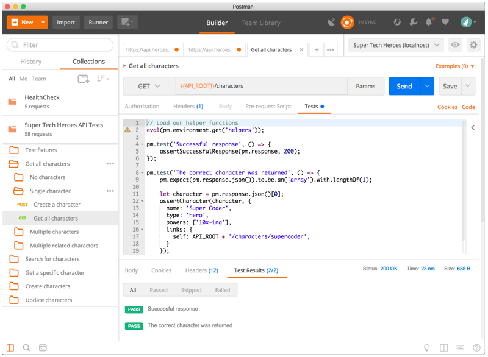
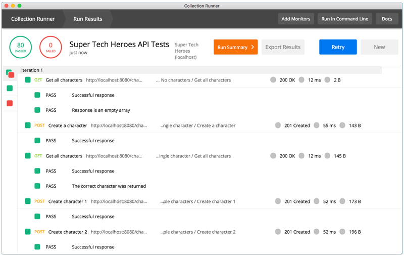
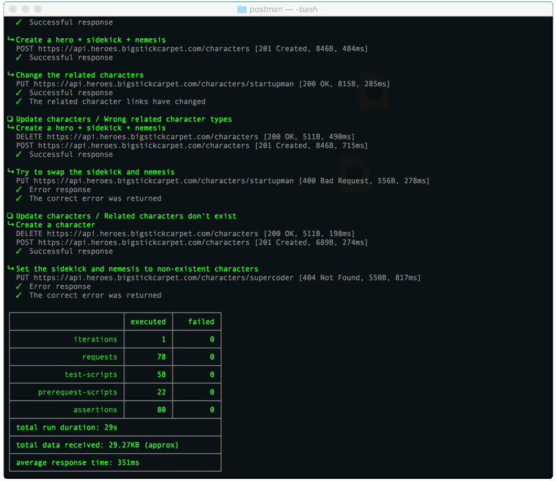

[](https://apitesting.jamesmessinger.com)

[](http://getpostman.com)
================================================================================

[Postman](http://getpostman.com) is a free app that makes it easy to build, test, and document your APIs.  It has powerful API testing features that strike a good balance between power and ease-of-use.

- **[Demo setup instructions](#demo-setup)**
- **[Testing one request at a time](#manual-testing)**
- **[Running tests in the Test Runner](#test-runner)**
- **[Running tests from the command line](#cli)**


JavaScript tests
--------------------------------------------------------------------------------
Postman tests are written in JavaScript using [a fluent-style syntax](https://www.getpostman.com/docs/postman/scripts/postman_sandbox_api_reference#pmresponsetobe).  There's no GUI test builder like there is in [Restlet](../restlet) or [Stoplight](../stoplight).  This means that the initial learning curve for writing tests may be a bit higher, but it also means that you have much more power and flexibility.

Postman includes [several JavaScript libraries](https://www.getpostman.com/docs/postman/scripts/postman_sandbox_api_reference) to help you with complex things like [hasing and encryption](https://code.google.com/archive/p/crypto-js/) or [JSON Schema validation](https://geraintluff.github.io/tv4/).


Flow control
--------------------------------------------------------------------------------
One powerful feature of Postman is the [`setNextRequest()` function](https://www.getpostman.com/docs/postman/scripts/branching_and_looping), which enables all sorts of [flow-control logic](https://www.getpostman.com/docs/postman/collection_runs/building_workflows).  You can conditionally skip certain requests, change the order of requests, repeat requests in a loop, etc.

For example, if your API returns paged results, you may need to repeat the same `GET` request several times to get all of the data.  The `setNextRequest()` function enables this, since you can keep setting the `GET` request as the next request until you reach the end of the results.


Re-using code
--------------------------------------------------------------------------------
Postman allows you to store data in [variables](https://www.getpostman.com/docs/postman/environments_and_globals/manage_environments), which helps reduce redundancy in your tests.  You can store anything in a variable, including JavaScript code.  This makes it easy to re-use code across multiple requests, such as common assertions, helper functions, or setup/teardown logic.

For example, the following code stores a helper function in a Postman variable.  This function contains validation logic for a mailing address, which can re-used by many different requests.

```javascript
pm.environment.set('assertValidAddress', function assertValidAddress (address) {
  pm.expect(address).to.be.an('object').with.keys('street1', 'street2', 'city', 'state', 'zip');
  pm.expect(address.street1).to.be.a('string').and.not.empty;
  pm.expect(address.street2).to.be.a('string');
  pm.expect(address.city).to.be.a('string').and.not.empty;
  pm.expect(address.state).to.be.a('string').with.lengthOf(2);
  pm.expect(address.zip).to.be.a('string').with.lengthOf(5).and.match(/^\d+$/);
});
```

Now that the helper function has been saved in a variable, you can use it anywhere in your tests.  You just need to [`eval()`](https://developer.mozilla.org/en-US/docs/Web/JavaScript/Reference/Global_Objects/eval) the variable to load the code into the test script.

```javascript
// Load the helper function
eval(pm.environment.get('assertValidAddress'));

// Now use it in a test!
pm.test('the response should be a valid address', () => {
  assertValidAddress(pm.response.json());
});
```


<a id="demo-setup"></a>

Demo Setup
--------------------------------------------------------------------------------
In this demo, you'll run the same API tests in the Postman app, and from the command-line.

### Step 1. Download and Install Postman
Go to the [Postman website](http://getpostman.com) and download the app for your operating system.

### Step 2. Open Postman
The first time you open the Postman app, it will ask you to sign in.  You can create a free account if you want, or you can skip the sign-in step and use Postman without an account.

### Step 3. Import the demo files
Click the "Import" button at the top of the Postman window, and import **both** of the following links:

#### Postman Collection
This file contains the API requests and the test scripts.

[`https://apitesting.jamesmessinger.com/postman/postman-collection.json`](https://github.com/James-Messinger/super-powered-api-testing/blob/v2/postman/postman-collection.json)

#### Postman Environment
This file contains environment variables, which allow the same Postman tests to be run in different environments (e.g. development, staging, prod)

[`https://apitesting.jamesmessinger.com/postman/postman-environment.json`](https://github.com/James-Messinger/super-powered-api-testing/blob/v2/postman/postman-environment.json)


<a id="manual-testing"></a>

Testing one request at a time
--------------------------------------------------------------------------------
You can open each API request one-by-one in Postman's [request builder](http://www.getpostman.com/docs/requests). This lets you see the details of each request, such as the URL, the HTTP method, headers, body, etc.  You can also see and edit the test scripts.

If you click the "Send" button in the request builder, it will send the request and automatically run the test script.  You can see the test results at the bottom of the screen.  Tests that succeeded are green, and any failed tests are red.




<a id="test-runner"></a>

Running tests in the test runner
--------------------------------------------------------------------------------
Postman's [test runner](http://www.getpostman.com/docs/running_collections-1) runs all of your tests and shows you the results in a friendly GUI.  Just click the "Runner" button at the top of the main Postman window.

In the test runner, you'll need to select the demo collection and environment from the lists.  Don't worry about the other settings for now.  Just click the "Run" button at the bottom of the screen and watch your tests run.  You'll see the same red and green indicators that you saw on the request builder.  In addition, you'll see an overview at the top, which shows the percentage of passeed and failed tests.




<a id="cli"></a>

Running tests from the command line
--------------------------------------------------------------------------------
[Newman](http://www.getpostman.com/docs/newman_intro) is Postman's command-line test runner.  If you prefer the CLI instead of a GUI, then this the tool for you.  It's also ideal for automated testing and [CI/CD integration](https://www.getpostman.com/docs/postman/postman_api/continuous_integration).  You can integrate Newman into any CI/CD system that supports Node.js, including [Travis-CI](https://www.getpostman.com/docs/postman/collection_runs/integration_with_travis), [Jenkins](https://www.getpostman.com/docs/postman/collection_runs/integration_with_jenkins), and others.



