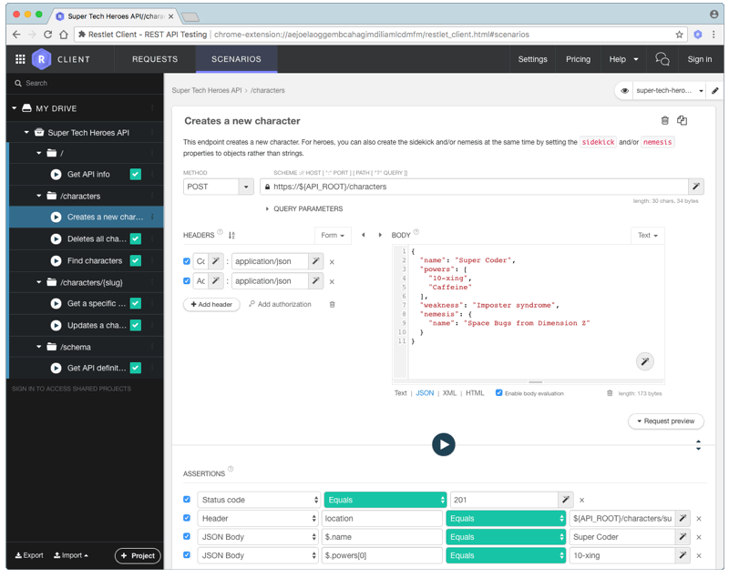
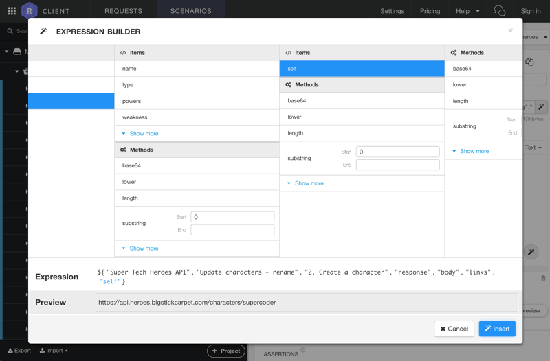
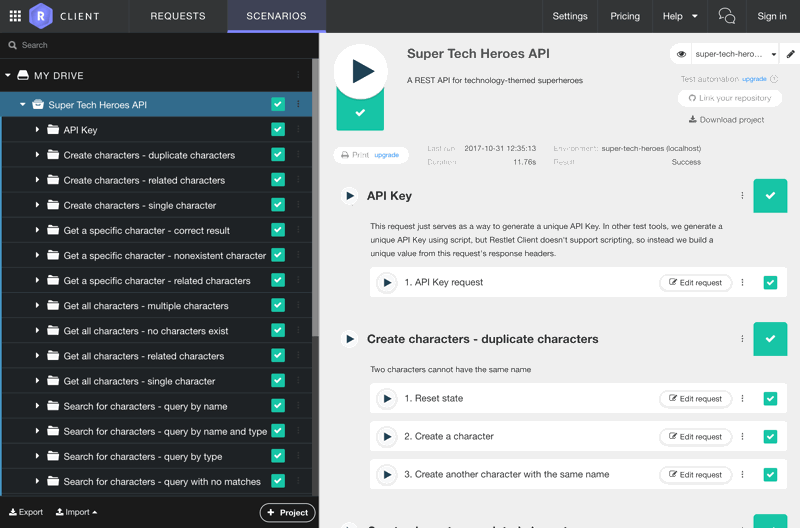
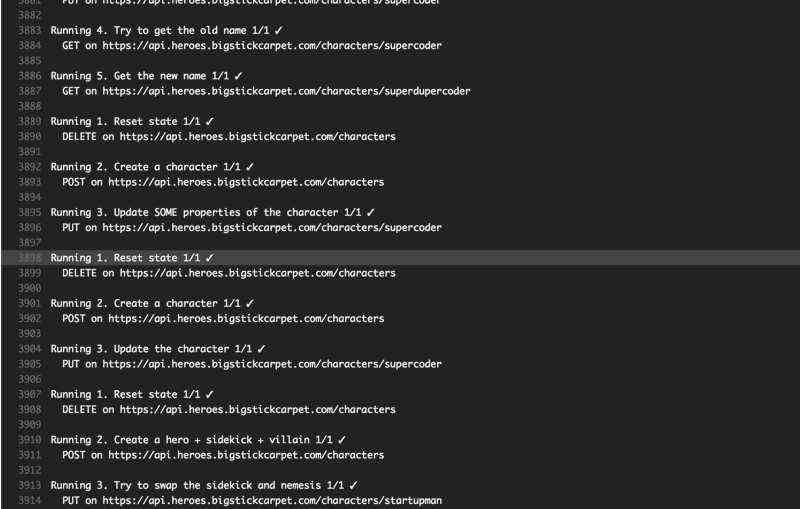

[](http://apitesting.bigstickcarpet.com)

[](https://restlet.com/)
================================================================================

[Restlet client](https://restlet.com) is a free Chrome extension that's so easy to use that _anybody_ can build API tests.

- **[Demo setup instructions](#demo-setup)**
- **[Running tests in Restlet](#test-runner)**
- **[Running tests from the command line](#cli)**


GUI test builder
--------------------------------------------------------------------------------
Creating API tests in Restlet is incredibly easy, thanks to their intuitive GUI assertion builder.  Just select a few values from some drop-down lists, or better yet, let Restlet auto-generate assertions for you based on the API response.  It couldn't be any easier.




Powerful expression builder
--------------------------------------------------------------------------------
[Restlet expressions](https://restlet.com/documentation/client/user-guide/test/make-your-requests-and-assertions-dynamic/expressions) allow you to use environment variables or values from previous requests and responses to populate any part of a request.  For example, Request A creates a new resource and gets back an auto-generated ID.  Request B can then update that resource using an expression that contains the ID from Request A.

Other API testing tools support this type of request chaining as well, but Restlet makes it incredibly easy by providing a GUI expression builder.  No need to remember the syntax. Just point-and-click your way to an expression.




<a id="demo-setup"></a>

Demo Setup
--------------------------------------------------------------------------------
In this demo, you'll run a full suite of API tests in Restlet and from the command line.

### Step 1. Install Restlet Client
Go to the [Restlet website](https://restlet.com/modules/client/) in Google Chrome and install the browser extension.

### Step 2. Open Restlet Client
The first time you open the Restlet Client extension, it may ask you to sign in.  You can create a free account if you want, or you can skip the sign-in step and use Restlet without an account.

### Step 3. Import the demo files
Click the "Import" button at the bottom, left of the Restlet window, and select "Import Restlet Client Repository".  Download the following file and import it:

#### Restlet Repository
This file contains the API requests and the test assertions as well as environment variables.

[`http://apitesting.bigstickcarpet.com/restlet/restlet-repository.json`](http://apitesting.bigstickcarpet.com/restlet/restlet-repository.json)


<a id="test-runner"></a>

Running tests in Restlet
--------------------------------------------------------------------------------
After importing the Restlet repository, you'll see a bunch of folders on the left.  Clicking on any folder will show a screen with a bunch of "Play" buttons.  You can click a "Play" button to run all the tests in a single folder or even just a single request.

To run **all** of the tests, click the top-level folder (named "Super Tech Heroes API") and then click the big "Play" button.  Restlet will start running all of the tests, and will show green check marks for successful tests, or red exes for failed tests.




<a id="cli"></a>

Running tests from the command line
--------------------------------------------------------------------------------
Running Restlet tests from the command line requires [Maven](https://maven.apache.org/) and [the JDK](http://www.oracle.com/technetwork/java/javase/downloads/index.html).  Once you have those installed and setup, you'll need to [create a `pom.xml` file](https://restlet.com/documentation/client/user-guide/automate/run-tests-from-cli) and get license key from Restlet.

For this demo, you can use [this `pom.xml` file](http://apitesting.bigstickcarpet.com/restlet/pom.xml). You can run the Restlet tests via Maven with the following command:

> **NOTE:** Both the `pom.xml` file and the `restlet-repository.json` file must be in the same directory

```
cd /path/to/demo/files
mvn test
```

You can also use Maven to automate Restlet tests or integrate it into your CI/CD pipeline.  Restlet and Maven will work with any CI/CD tool that supports Java, such as [TravisCI](http://restlet.com/company/blog/2017/01/19/run-your-api-test-scenarios-on-travis-ci-with-dhc-by-restlet/) or [Jenkins](https://restlet.com/documentation/client/tutorials/test-api-on-jenkins)



