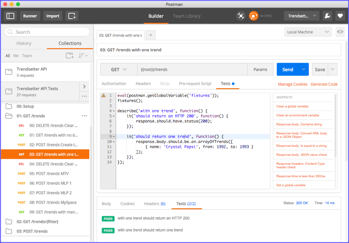

Super-Powered API Testing
============================

[](http://getpostman.com)

Postman is a totally different kind of API testing tool from all the other frameworks in this project.  Instead of using a text editor to write your tests, you use the [Postman app](http://getpostman.com/apps), which has an easy-to-use GUI interface where you can build your HTTP requests and organize them into [collections](http://www.getpostman.com/docs/collections).

You don't have to write any code to send the HTTP request.  Postman does that for you.  The only code you need to write is assertions for the HTTP response, which couldn't be easier.  All you do is set boolean properties on a `tests` object.  Any properties with a truthy value are passed tests, and any with a falsy value are failed tests.

Here's an example:

```javascript
tests["Status code is 200"] = responseCode.code === 200;

tests["Content-Type is JSON"] = postman.getResponseHeader("Content-Type") === "application/json";

var response = JSON.parse(responseBody);
tests["First name is set"] = response.name.first === "John";
tests["Last name is set"] = response.name.last === "Doe";
```

For more details about writing tests in Postman, see the [online documentation](http://www.getpostman.com/docs/writing_tests).


Postman BDD
--------------------------
All of the tests in this project use [Behavior Driven Development (BDD) syntax](https://mochajs.org/#bdd).  BDD is the default syntax for [Chakram](../chakram), [SuperTest](../supertest), and [Chai-HTTP](../chai-http), but it's _not_ the default for Postman. To use BDD syntax in Postman, you'll need to use [Postman BDD](https://github.com/BigstickCarpet/postman-bdd).

Postman BDD is a direct port of [Chai-HTTP](../chai-http) to Postman, so the syntax is identical.  The only difference is that you don't need to write any code to send the HTTP request, since Postman does that part for you.

Here's an example:

```javascript
// load Postman BDD
eval(postman.getGlobalVariable('postmanBDD'));

describe('add a trend', function() {
  it('should return an HTTP 201', function() {
    response.should.have.status(201);
  });

  it('should return only the new trend', function() {
    response.body.should.be.an('array').with.lengthOf(1);
    response.body.should.have.deep.members([
      {"name": "Fixed-gear Bicycles", "from": 1950, "to": 1959}
    ]);
  });
});
```


The different modes of Postman
--------------------------
There are three different ways that you can run your tests in Postman, depending on whether you're debugging, testing, doing continuous integration, etc.

### Request Builder
The [request builder](http://www.getpostman.com/docs/requests) is what you see when you first open the app.  Here, you can build HTTP requests in an easy-to-use GUI, view the results, write tests, and organize your requests into collections.  This mode is great for day-to-day development and debugging, and for running individual requests.




### Collection Runner
The [collection runner](http://www.getpostman.com/docs/running_collections-1) is Postman's test runner.  It can run all of your tests, or just the tests in a single folder.  You can also load a data file (JSON or CSV), and your tests will be run against each row of data in teh file.  When your tests are done running, you get a pass/fail summary, and you can drill-down to see the detailed results for any request.


### Newman
[Newman](http://www.getpostman.com/docs/newman_intro) is a command-line version of Postman's collection runner.  If you prefer the CLI instead of a GUI, then this the tool for you.  It's also ideal for [continuous-integration](https://en.wikipedia.org/wiki/Continuous_integration) and [continuous-delivery](https://en.wikipedia.org/wiki/Continuous_delivery) testing.  Just like the collection runner, you can run your entire suite of tests, or just a single folder.  You can load data from a file, and even write the test results to an output file in various formats (JSON, XML, HTML)


